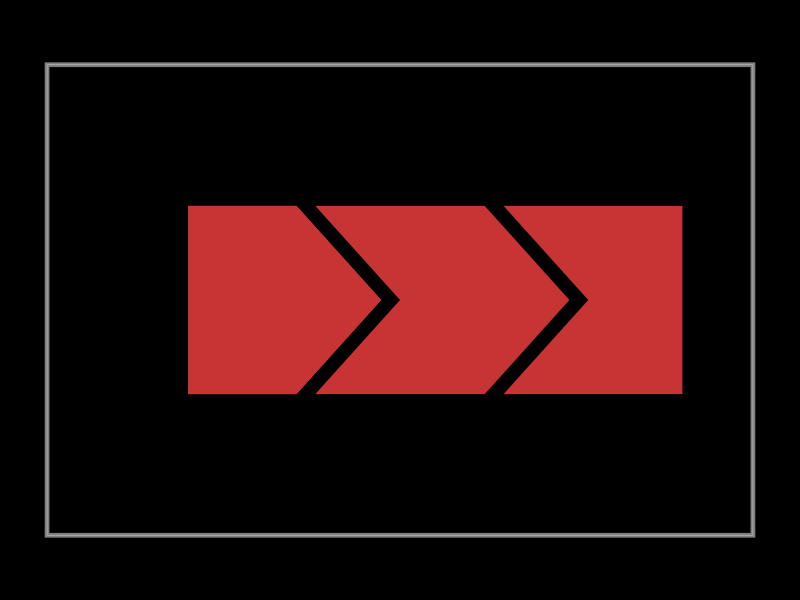

## Overview

Capacitive touch sensors detect when a finger changes the electric field around an electrode. In this tutorial you'll design a multi-pad capacitive touch interface in tscircuit, route it to a common microcontroller, and understand the layout practices that keep the sensor reliable.

import CircuitPreview from "@site/src/components/CircuitPreview"

<CircuitPreview
  defaultView="pcb"
  hide3DTab
  hideSchematicTab
  code={`
import { useESP32_DEVKIT_V1 } from "@tsci/seveibar.ESP32_DEVKIT_V1"
import { polygon, translate } from "@tscircuit/math-utils"

const electrodeShape = polygon([
  { x: -18, y: -18 },
  { x:  18, y: -18 },
  { x:  36, y:   0 },
  { x:  18, y:  18 },
  { x: -18, y:  18 },
])

const electrodeOffsets = [
  { x: -55, y: 0 },
  { x:   0, y: 0 },
  { x:  55, y: 0 },
]

export default () => {
  const controller = useESP32_DEVKIT_V1("U1")

  return (
    <board width="80mm" height="60mm" routingDisabled>
      <controller pcbX={-20} pcbY={0} schX={0} schY={0} />

      {electrodeOffsets.map((offset, index) => {
        const padName = `PAD${index + 1}`
        return (
          <>
            <pad
              name={padName}
              pcbShape={translate(electrodeShape, offset)}
              layer="top"
              net={`TOUCH${index + 1}`}
            />
            <trace from={`.${padName}`} to={controller[`GPIO${index + 12}`]} />
          </>
        )
      })}

      <trace from={controller.GND1} to="net.GND" />
      <trace from={controller.GND2} to="net.GND" />
    </board>
  )
}
  `}
/>

## Why Build a Capacitive Touch Sensor?

Capacitive touch pads offer a sleek alternative to mechanical buttons. They have no moving parts, tolerate moisture better than resistive touch screens, and can be shaped to match your product's industrial design. With tscircuit you can prototype these electrodes directly on a virtual PCB before committing to fabrication.

## Requirements

To follow this tutorial you'll need:

- A basic understanding of tscircuit boards, pads, and traces
- A microcontroller or sensor IC capable of capacitive sensing (we'll use an ESP32 DevKit)
- Electrode geometry for each touch pad
- Reference ground pour or guard ring for noise immunity

## Step 1 – Create the Electrode Geometry

Capacitive electrodes are usually large copper areas. In the example above, each pad is defined by a simple polygon that creates a leaf-shaped electrode. Translate the polygon to create multiple pads, and name the pads so that the rest of the circuit can connect to them.

```tsx
const electrodeShape = polygon([
  { x: -18, y: -18 },
  { x:  18, y: -18 },
  { x:  36, y:   0 },
  { x:  18, y:  18 },
  { x: -18, y:  18 },
])
```

## Step 2 – Connect the Electrodes to the Controller

Each pad needs its own sensing input. Many microcontrollers, including the ESP32 family, expose multiple capacitive sense pins. Use `<trace>` elements to connect the pads to the desired controller pins, keeping the routes as short and straight as possible to reduce stray capacitance.

```tsx
<trace from=".PAD1" to={controller.GPIO12} />
<trace from=".PAD2" to={controller.GPIO13} />
<trace from=".PAD3" to={controller.GPIO14} />
```

## Step 3 – Provide a Stable Ground Reference

Capacitive sensing relies on a stable reference. Add a continuous ground plane on the opposite layer or route dedicated ground traces around the electrodes. In the `CircuitPreview` example we tie multiple ground pins from the controller to the `GND` net so that any pour or guard ring is well referenced.

## Step 4 – Add Shielding and Filtering

For production designs, add guard rings tied to a driven shield output or ground, keep digital switching traces away from the electrodes, and optionally place an RC filter on each sensing line. tscircuit allows you to model these traces and components to confirm there is adequate spacing.

## Step 5 – Calibrate in Firmware

Once the hardware layout is complete, write firmware to measure the capacitance of each pad. A typical workflow is:

1. Initialize each capacitive touch channel.
2. Measure the baseline capacitance with no touch.
3. Continuously sample each channel and compare it against the baseline.
4. Trigger touch events when the delta exceeds a threshold.

Microcontroller SDKs such as ESP-IDF or Arduino provide helper APIs for reading capacitive touch values and setting thresholds.

## Visualizing the Electrode Layout

The SVG below shows a multi-pad electrode layout similar to the board rendered in tscircuit. You can embed it into other documentation or print it for presentations.



## Next Steps

- Add LED feedback or haptic drivers that react to touch events.
- Export manufacturing files from tscircuit and order a prototype PCB.
- Experiment with different pad shapes to see how they affect sensitivity.

By the end of this tutorial you should have a capacitive touch sensor ready to integrate into a larger user interface project.
